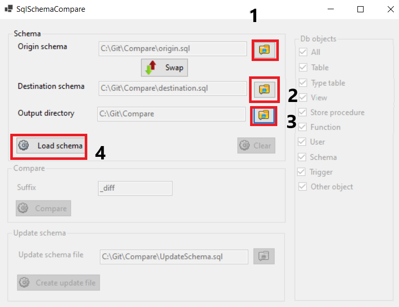

This project use [ANTLRv4](https://github.com/antlr/antlr4) to parse TSql schema and build two compare file and one update schema.

# How to use:

Extract from SqlManagement the database creation schemas of the origin and destination databases.

1. Choose the origin schema database.
2. Choose the destination schema database.
3. Load schema.

1. Choose a suffix(_diff is the default) and an output directory.
2. Choose a file name. It will contain the update schema.
3. Choose the db objects that you want compare or you want update.
4. Click compare to generate two files with the difference between schemas.
5. Click create update file to create a file with sql statement to modify the destination as origin database.

Use clear to load other schemas
## Compare
The compare feature creates two files that you can compare with WinMerge or other tool for comparing file. 
This feature discard from the schemas the objects that are equals and put in the files the creation statements that are different. They are ordered alphabetically.
You can choose the output directory where create the diff files and a suffix. 

The name of the diff files created are: 
* origin + suffix.extensionOfOriginFile
* destination + suffix.extensionOfDestinationFile

An ErrorCompare.txt file is created with errors when parsing.

## Update schema
Update feature creates an update schema from origin to destination. 
You can choose the name of update schema file.

An erro file is created with errors when parsing with name:
* UpdateSchemaFileName + _errorsUpdateSchema.extensionOfUpdateSchemaFileName 

